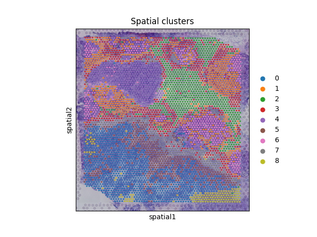
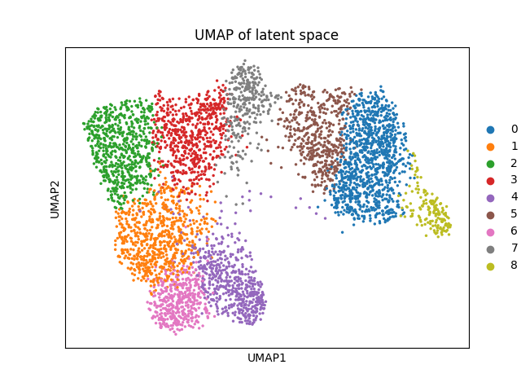

# Visium Human Breast Cancer analysis using Spatial VAE

### Quick Start

```
mkdir data
cd data
```

Then, download the `Visium_Human_Breast_Cancer` [Dataset](https://www.10xgenomics.com/datasets/human-breast-cancer-visium-fresh-frozen-whole-transcriptome-1-standard) using the following commands 

```
curl -O https://cf.10xgenomics.com/samples/spatial-exp/1.3.0/Visium_Human_Breast_Cancer/Visium_Human_Breast_Cancer_molecule_info.h5
curl -O https://cf.10xgenomics.com/samples/spatial-exp/1.3.0/Visium_Human_Breast_Cancer/Visium_Human_Breast_Cancer_filtered_feature_bc_matrix.h5
curl -O https://cf.10xgenomics.com/samples/spatial-exp/1.3.0/Visium_Human_Breast_Cancer/Visium_Human_Breast_Cancer_filtered_feature_bc_matrix.tar.gz
curl -O https://cf.10xgenomics.com/samples/spatial-exp/1.3.0/Visium_Human_Breast_Cancer/Visium_Human_Breast_Cancer_raw_feature_bc_matrix.h5
curl -O https://cf.10xgenomics.com/samples/spatial-exp/1.3.0/Visium_Human_Breast_Cancer/Visium_Human_Breast_Cancer_raw_feature_bc_matrix.tar.gz
curl -O https://cf.10xgenomics.com/samples/spatial-exp/1.3.0/Visium_Human_Breast_Cancer/Visium_Human_Breast_Cancer_analysis.tar.gz
curl -O https://cf.10xgenomics.com/samples/spatial-exp/1.3.0/Visium_Human_Breast_Cancer/Visium_Human_Breast_Cancer_spatial.tar.gz
curl -O https://cf.10xgenomics.com/samples/spatial-exp/1.3.0/Visium_Human_Breast_Cancer/Visium_Human_Breast_Cancer_spatial_enrichment.csv
curl -O https://cf.10xgenomics.com/samples/spatial-exp/1.3.0/Visium_Human_Breast_Cancer/Visium_Human_Breast_Cancer_metrics_summary.csv
curl -O https://cf.10xgenomics.com/samples/spatial-exp/1.3.0/Visium_Human_Breast_Cancer/Visium_Human_Breast_Cancer_web_summary.html
curl -O https://cf.10xgenomics.com/samples/spatial-exp/1.3.0/Visium_Human_Breast_Cancer/Visium_Human_Breast_Cancer_cloupe.cloupe
```

Then, to install packages, run
```
uv sync
```

Finally, run the following to train the model
```
uv run main.py
```


## Loss function
We utlize the following loss function in this work:

$$
\mathcal{L}
=
\|x - \hat{x}\|_2^2
\;+\;
\beta \cdot \tfrac{1}{2}
\left(\mu^2 + e^{\log\sigma^2} - 1 - \log\sigma^2\right)
\;+\;
\lambda_{\text{spatial}} \cdot
\frac{1}{|E|}\sum_{(u,v)\in E} \| z_u - z_v \|_2^2$$


## Results

We observe distinct clusters and spatial element classification as indicated in the spatial clusters




We also observe proper latent space clustering




